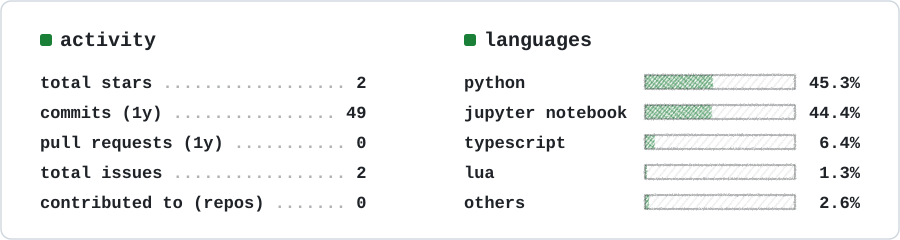

### About me

Hi, I’m Antareep Dey, a computer vision researcher interested in efficient learning algorithms. I enjoy working at the intersection of research and engineering. At the same time, I build things just for fun, whether it’s a small experiment, a side project, or an idea that I simply want to explore. 

To know more visit my [Website](https://antareepdey.github.io).

### Skills.md
 
```md
## languages
- [x] python          
- [x] c++            
- [x] sql
- [x] Bash      

## Tech Stack
- [x] Pytorch        
- [x] Transformers, Diffusers      
- [x] CUDA
- [x] Slurm
- [x] Weight&Biases

## Tools
- [x] Zed IDE
- [x] Git
- [x] Figma
- [x] Claude Code

## in progress
- [ ] Learning about Flow Matching
- [ ] a sleep schedule
```
### Stats :
<picture>
  <source media="(prefers-color-scheme: dark)" srcset="assets/stats-dark.svg">
  
</picture>
<div align="center">
<sub>Last compiled Sep 2026, somewhere between the second and third coffee.</sub>
</div>
